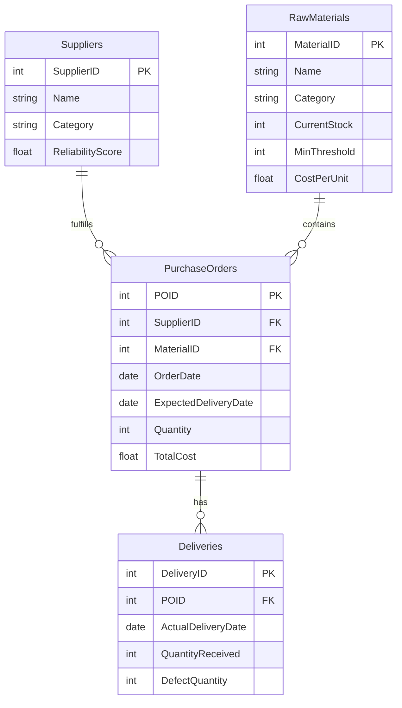

# Database Design: Procurement Reliability

This document outlines the SQLite schema created for the Procurement Reliability Dashboard (Problem Statement P2).

## Entity Relationship Diagram

## Tables & Attributes

### 1. Suppliers
Stores information about raw material vendors.
| Column | Type | Description |
|---|---|---|
| `SupplierID` | `INTEGER` | Primary Key |
| `Name` | `TEXT` | Name of the supplier |
| `Category` | `TEXT` | Sector (Electronics, Metals, Plastics, etc.) |
| `ReliabilityScore` | `REAL` | Score (0-1) evaluating past performance |

### 2. RawMaterials
Details of materials procured by the company.
| Column | Type | Description |
|---|---|---|
| `MaterialID` | `INTEGER` | Primary Key |
| `Name` | `TEXT` | Material product name |
| `Category` | `TEXT` | Sector |
| `CurrentStock` | `INTEGER` | Quantities currently in the warehouse |
| `MinThreshold` | `INTEGER` | Point at which reorder should trigger |
| `CostPerUnit` | `REAL` | Standard unit price of the material |

### 3. PurchaseOrders
Orders issued to suppliers.
| Column | Type | Description |
|---|---|---|
| `POID` | `INTEGER` | Primary Key |
| `SupplierID` | `INTEGER` | FK -> Suppliers |
| `MaterialID` | `INTEGER` | FK -> RawMaterials |
| `OrderDate` | `DATE` | Date PO was placed |
| `ExpectedDeliveryDate` | `DATE` | Anticipated delivery deadline |
| `Quantity` | `INTEGER` | Number of units ordered |
| `TotalCost` | `REAL` | Total financial value of the PO |

### 4. Deliveries
Information regarding actual fulfillment.
| Column | Type | Description |
|---|---|---|
| `DeliveryID` | `INTEGER` | Primary Key |
| `POID` | `INTEGER` | FK -> PurchaseOrders |
| `ActualDeliveryDate` | `DATE` | Arrival date of the shipment |
| `QuantityReceived` | `INTEGER` | How many units successfully arrived |
| `DefectQuantity` | `INTEGER` | Number of broken/rejected units |

